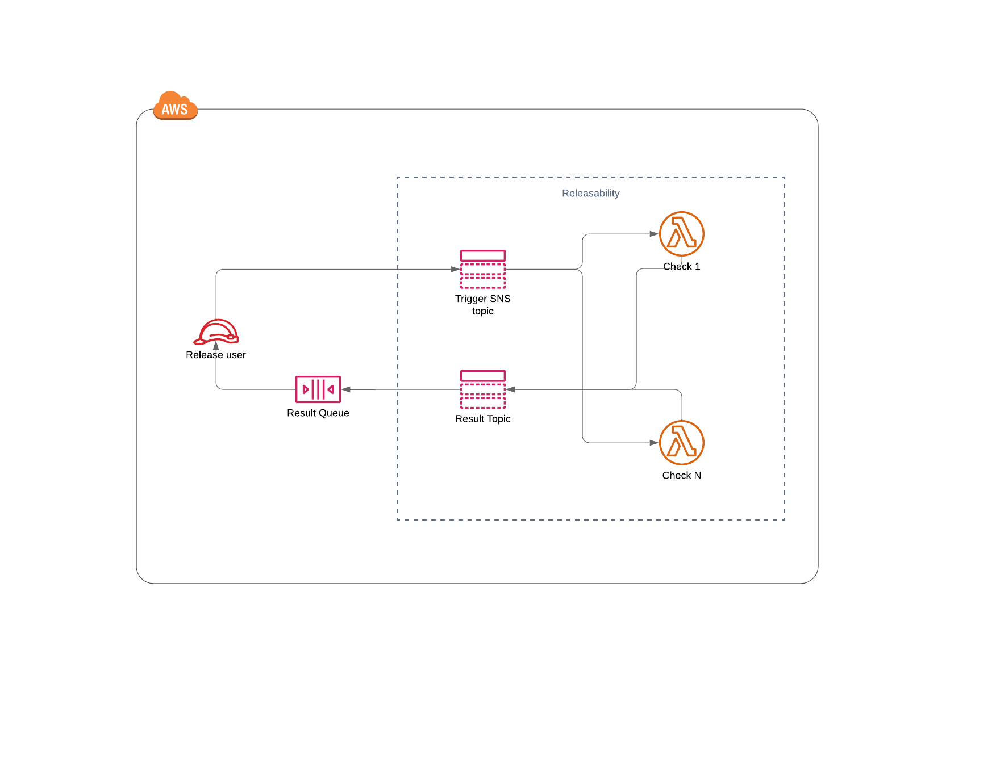

## Architecture

Check the following [architecture diagram](https://lucid.app/lucidchart/5410fdee-b5ec-48a3-8a34-d1453aa69239/edit?invitationId=inv_4146de62-e396-4629-8bb6-368df0ce2d40).



This stack is dedicated to the release workflow and must be installed on top of the [Releasability stack](https://github.com/SonarSource/ops-releasability).

It creates the following resources with the required permissions:
* an IAM user used to trigger the releasability checks from the release action and get the response
* a queue to get results of the releasability checks

## Prerequisites

- AWS CLI: check the [installation guide](https://docs.aws.amazon.com/cli/latest/userguide/getting-started-install.html) on the AWS documentation
- The `$HOME/.aws/config` file from [sonarsource-iam](https://github.com/SonarSource/sonarsource-iam/blob/master/re-config)

## Deployment

For Dev:
```
make deploy-dev
```

For Staging:
```
make deploy-staging
```

For Prod:
```
make deploy-prod
```
